


I'm a maths undergraduate. This is a compendium of small programming projects I've been doing through the years, mostly early high-school experiments but things I'm working on now. Most of them are physics simulations, games and small tools, written in Python.

The repositories were uploaded recently, so their commit dates don't show when each project was written. Each README explains how the project works, how to run it and what is still unfinished.

## Simulations

<table>
  <tr>
    <td width="50%" valign="top">
      <a href="https://github.com/lnivan/ragdoll-physics">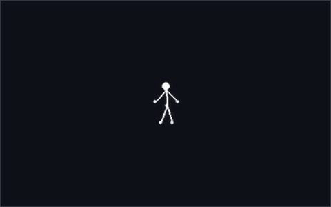</a>
       <a href="https://github.com/lnivan/ragdoll-physics"><b>Ragdoll Physics</b></a>
       An interactive 2D ragdoll built from point masses, rigid distance constraints and spring–damper joints, integrated with position Verlet. The figure can be dragged, thrown and pushed.
       Python · NumPy · Pygame
    </td>
    <td width="50%" valign="top">
      <a href="https://github.com/lnivan/soft-body-sim">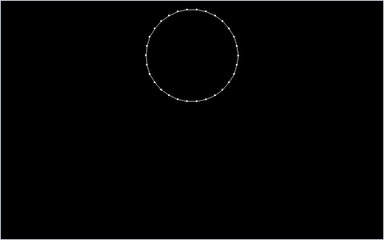</a>
       <a href="https://github.com/lnivan/soft-body-sim"><b>Soft Body Sim</b></a>
       A soft-body simulation: a ring of point masses in which every pair is joined by a damped spring, deforming under gravity when it hits the floor.
       Python · Pygame
    </td>
  </tr>
  <tr>
    <td width="50%" valign="top">
      <a href="https://github.com/lnivan/spring-mass-simulator">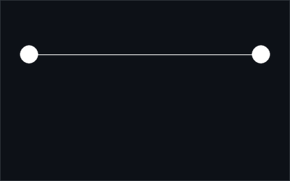</a>
       <a href="https://github.com/lnivan/spring-mass-simulator"><b>Spring–Mass Simulator</b></a>
       A chain of point masses connected by damped springs, suspended between two anchors and integrated with semi-implicit Euler.
       Python · Pygame
    </td>
    <td width="50%" valign="top">
      <a href="https://github.com/lnivan/elastic-ball-collisions">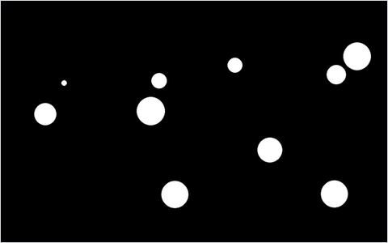</a>
       <a href="https://github.com/lnivan/elastic-ball-collisions"><b>Elastic Ball Collisions</b></a>
       Elastic collisions between balls of different masses, with each impact resolved along the line joining their centres.
       Python · Pygame
    </td>
  </tr>
  <tr>
    <td width="50%" valign="top">
      <a href="https://github.com/lnivan/rocket-orbit-sim">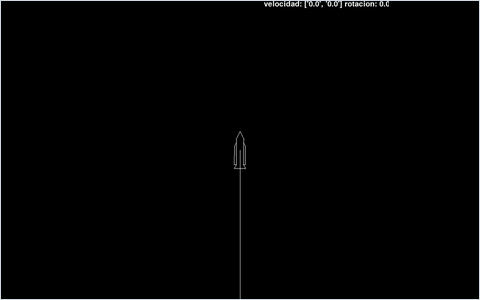</a>
       <a href="https://github.com/lnivan/rocket-orbit-sim"><b>Rocket Orbit Sim</b></a>
       A rocket launched from a real-scale Earth under Newtonian gravity, with steerable thrust, zoom and a live prediction of its trajectory.
       Python · Pygame
    </td>
    <td width="50%" valign="top">
      <a href="https://github.com/lnivan/n-body-gravity">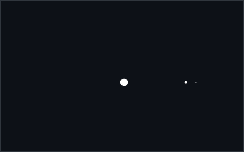</a>
       <a href="https://github.com/lnivan/n-body-gravity"><b>N-Body Gravity</b></a>
       A gravitational simulation of a star, a planet and its moon, each attracting the others.
       Python · Pygame
    </td>
  </tr>
</table>

## Games and graphics

<table>
  <tr>
    <td width="50%" valign="top">
      <a href="https://github.com/lnivan/minecraft-2d">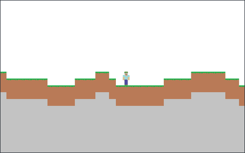</a>
       <a href="https://github.com/lnivan/minecraft-2d"><b>Minecraft 2D</b></a>
       A side-view block sandbox with procedurally generated terrain, gravity and collisions, block placement and removal, and TNT explosions.
       Python · Pygame
    </td>
    <td width="50%" valign="top">
      <a href="https://github.com/lnivan/asteroids">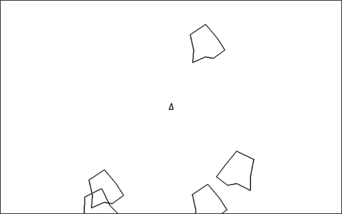</a>
       <a href="https://github.com/lnivan/asteroids"><b>Asteroids</b></a>
       A version of the arcade game with inertial ship movement, screen wrap-around and asteroids that split when hit.
       Python · Pygame
    </td>
  </tr>
  <tr>
    <td width="50%" valign="top">
      <a href="https://github.com/lnivan/parabola-targets">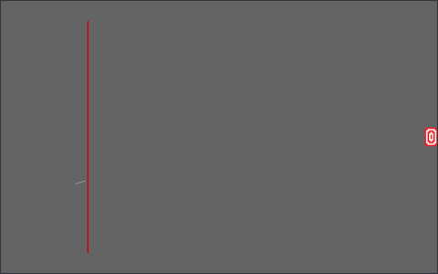</a>
       <a href="https://github.com/lnivan/parabola-targets"><b>Parabola Targets</b></a>
       A physics puzzle game: launch a projectile with a slingshot-style control and get it past the obstacles into the target, across several levels.
       Python · Pygame
    </td>
    <td width="50%" valign="top">
      <a href="https://github.com/lnivan/wireframe-3d">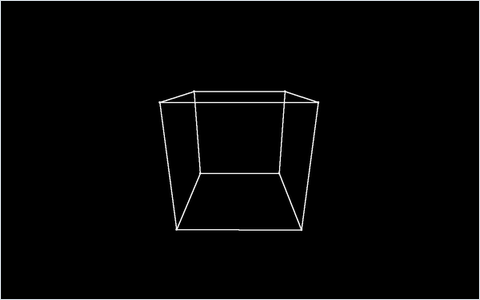</a>
       <a href="https://github.com/lnivan/wireframe-3d"><b>Wireframe 3D</b></a>
       A software wireframe renderer that uses no 3D library: custom vector and matrix classes, perspective projection and a free-flying camera.
       Python · Pygame
    </td>
  </tr>
</table>

Also: [Geometry Viewer 3D](https://github.com/lnivan/geometry-viewer-3d), a 3D point viewer built on its own vector and matrix classes.

## Tools

<table>
  <tr>
    <td width="50%" valign="top">
      <a href="https://github.com/lnivan/screen-explainer"></a>
       <a href="https://github.com/lnivan/screen-explainer"><b>Screen Explainer</b></a>
       A desktop utility started with a global hotkey. The selected region of the screen is sent to the Gemini API, and the explanation appears in a floating window (illustration).
       Python · PyQt6 · Gemini API
    </td>
    <td width="50%" valign="top">
      <a href="https://github.com/lnivan/snake-autoplayer">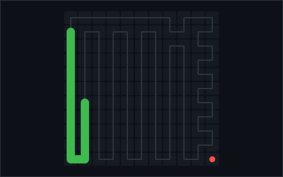</a>
       <a href="https://github.com/lnivan/snake-autoplayer"><b>Snake Autoplayer</b></a>
       A bot that plays a browser Snake game by reading the screen and sending keystrokes. It alternates between two fixed routes that together cover the whole board (one is shown above).
       Python · Pillow
    </td>
  </tr>
</table>

Also: [Image Grid Splitter](https://github.com/lnivan/image-grid-splitter), a utility that splits an image into a 4 × 4 grid for printing it as a poster.
